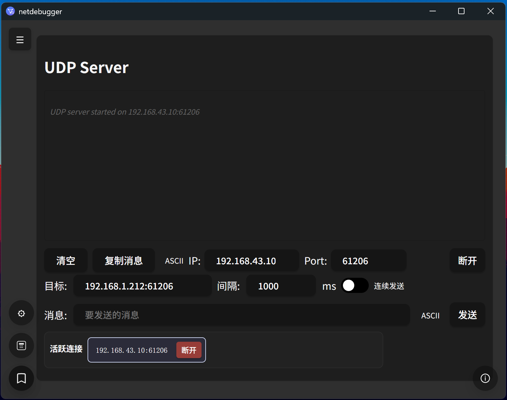
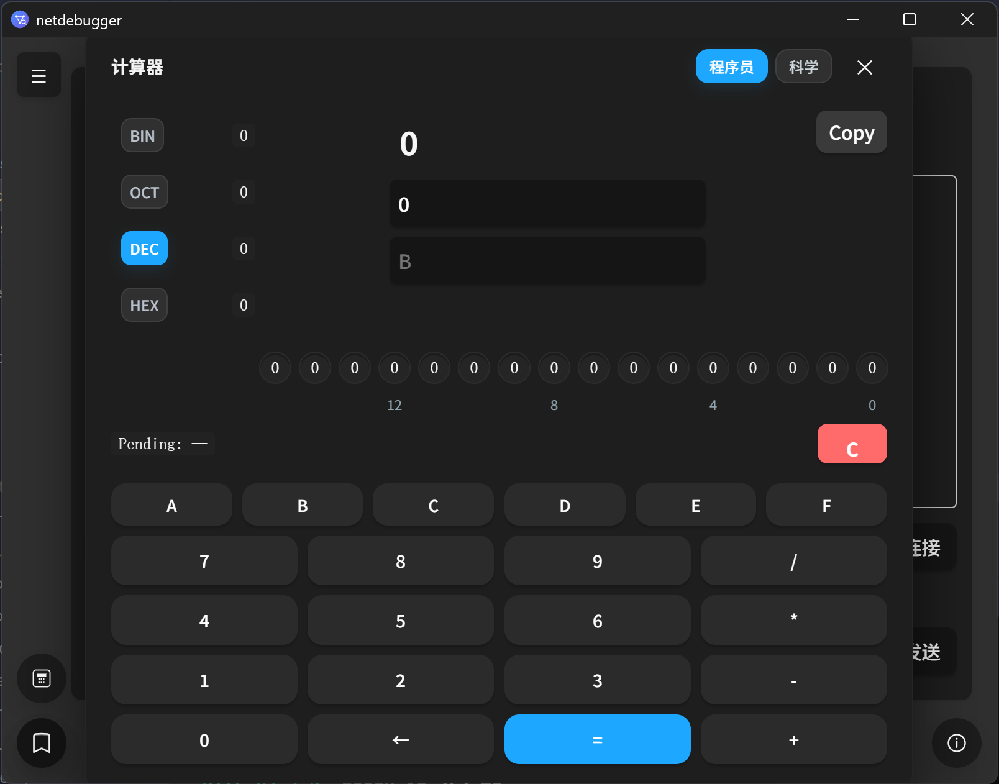
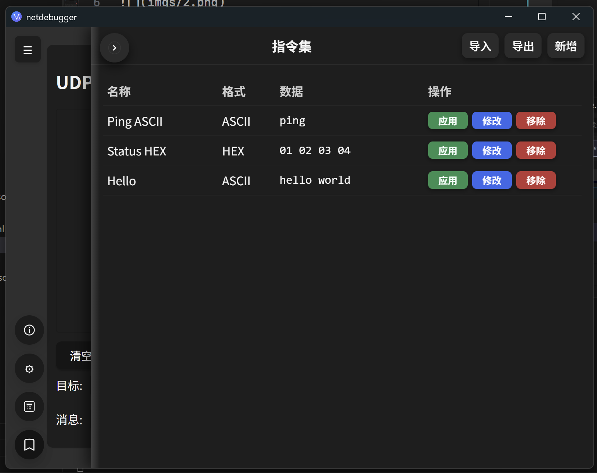
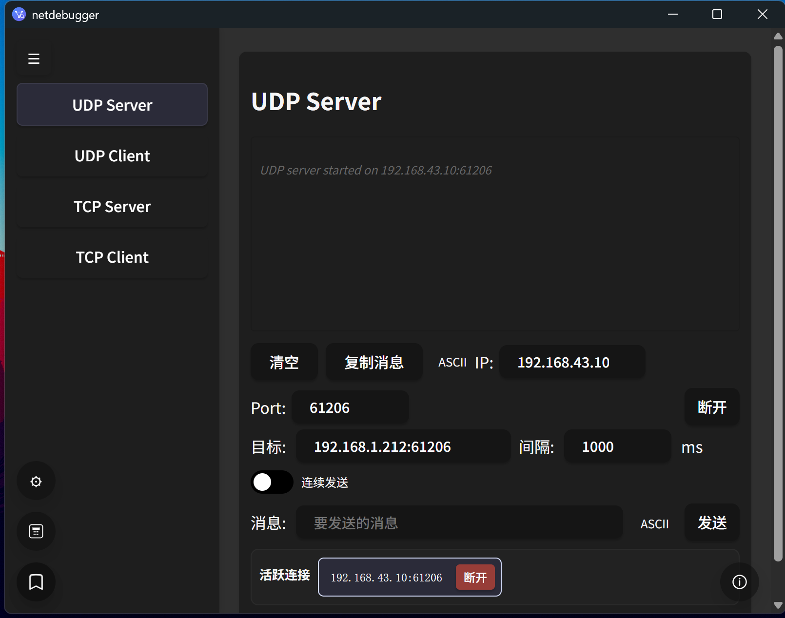

# NetDebugger

这是一个网络调试工具，集成了 UDP/TCP 的 Server/Client 功能，便于发送/接收报文、回放指令集与快速调试。

**特性概览**
- **UDP/TCP Server & Client**: 绑定端口、接收/发送消息、查看已连接客户端。
- **指令集（Commands）**: 可保存/导入/导出常用指令，应用到当前激活的视图（UDP/TCP、Server/Client）。
- **历史记录**: 发送目标、发送内容与绑定信息自动保存。
- **程序员计算器**: 内置计算器便于处理十六进制/二进制数值。

**快速开始**
- 在Release中下载最新版安装包。

**使用说明（重点）**
- 打开应用后，通过侧边栏选择视图：`UDP Server` / `UDP Client` / `TCP Server` / `TCP Client`。
- 指令集：点击右下角的指令图标打开指令侧栏，可以 `导入` / `导出` / `新增` / `移除` 指令。
- 应用指令：在指令列表点击 “应用” 时，指令会注入到当前激活的视图（例如你正在看 `UDP Client`，则将填入该视图的发送框）。
